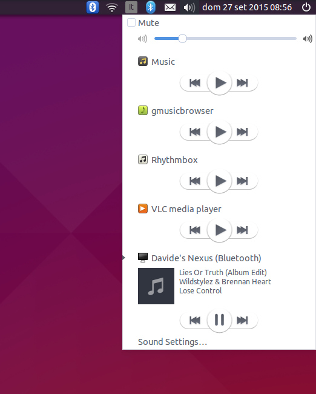

# BlueMPRIS
Exports connected Bluetooth media players to MPRIS to show them in the sound menu.

## Usage

Simply run the Python script. Run it as a startup application to enable it automatically.

Connect a Bluetooth player and play some music. The song information will be shown in the sound menu.

## Packages

This project needs a maintainer! If you are able to build debian packages, contact me! (my email is in my GitHub profile)
